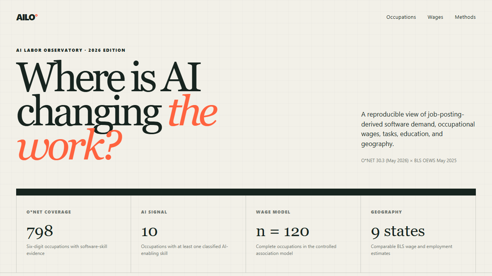
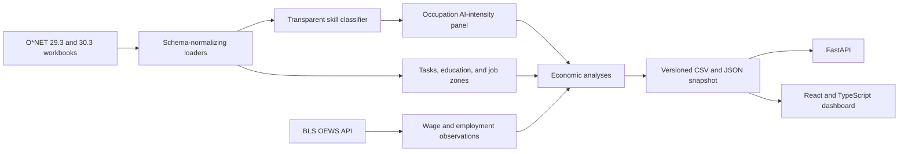

# AI Labor Observatory

An evidence-backed, reproducible view of how AI-related software demand intersects with
occupations, wages, tasks, education, and geography in the United States.

**[Open the live dashboard](https://aarav-nagar.github.io/ai-labor-observatory/)**

This is not another job-search chatbot. It is a small labor-economics data product:

- **Demand:** employer-job-posting-derived hot and in-demand software signals published
  in the CC BY 4.0 O*NET database
- **Outcomes:** BLS Occupational Employment and Wage Statistics (OEWS)
- **Work content:** O*NET core tasks, education distributions, and job zones
- **AI layer:** an inspectable lexicon-first, TF-IDF linear skill classifier
- **Product:** a Python pipeline and API with a React/TypeScript research dashboard

> **Interpretation boundary:** the wage model reports occupation-level associations.
> It does not estimate the causal return to an individual learning an AI skill.



## What it answers

1. Which occupations carry the strongest AI-enabling software-skill signals?
2. Which occupations changed most between the May 2025 and May 2026 O*NET releases?
3. Are stronger AI signals associated with higher occupational median wages after basic
   controls?
4. Which task families are overrepresented in high-AI-intensity occupations?
5. How do wages and employment for selected AI-intensive occupations differ across states?
6. How do education requirements and skill clusters relate to the signal?

## Product tour

The dashboard includes:

- ranked occupation intensity with BLS wages
- fastest-moving occupations between versioned releases
- an HC3-robust occupation-level wage model with an explicit noncausal interpretation
- task-family lift for the top AI-intensity quartile
- state wage indices for featured occupations
- visible data and methodology limitations

## Snapshot findings

The committed O*NET 30.3 / BLS May 2025 snapshot finds:

- 798 normalized six-digit occupation groups, of which 10 have an explicit core-AI/ML
  software signal under the conservative gate
- the strongest signals in Computer and Information Research Scientists (9.00),
  Data Scientists (6.88), and Financial Risk Specialists (3.85)
- no statistically distinguishable conditional wage association in this sample:
  a 10-point higher score is associated with -2.5% different median wages
  (HC3 p = 0.901)
- creative/communication, analytical-judgment, and technical/computational core tasks
  are respectively 2.94×, 2.44×, and 2.30× as prevalent in the top intensity quartile
  as in other occupations

These are descriptive release-specific results. In particular, the null wage result is
evidence against claiming an occupational “AI wage premium” from this dataset—not proof
that individual AI skills have no labor-market value.

## Architecture



## Quick start

Requires Python 3.11+ and Node 22+.

```bash
python -m venv .venv
source .venv/bin/activate  # Windows: .venv\Scripts\activate
pip install -e ".[dev]"

labor-observatory fetch-sources --destination data/raw
labor-observatory build \
  --previous-dir data/raw/onet_29_3 \
  --current-dir data/raw/onet_30_3 \
  --output-dir data/sample

labor-observatory serve --data-dir data/sample
```

In a second terminal:

```bash
cd frontend
npm ci
npm run dev
```

The API runs at `http://127.0.0.1:8000`; the dashboard runs at
`http://127.0.0.1:5173`.

The repository includes a committed analytical snapshot, so the dashboard can also be
built without downloading the raw workbooks:

```bash
cd frontend
npm ci
npm run build
```

## CLI

```bash
# Explain a skill classification
labor-observatory classify "PyTorch model training"

# Build all evidence artifacts
labor-observatory build --previous-dir ... --current-dir ... --output-dir data/sample

# Rebuild features without network calls, using the versioned BLS cache
labor-observatory build --previous-dir ... --current-dir ... \
  --output-dir data/sample --offline

# Serve summary and occupation endpoints
labor-observatory serve --data-dir data/sample
```

Example classifier output:

```json
{
  "label": "core_ai_ml",
  "confidence": 1.0,
  "method": "lexicon",
  "matched_terms": ["pytorch"]
}
```

## AI-intensity score

Each software skill is assigned to one of four AI-enabling categories:

| Category | Weight | Interpretation |
|---|---:|---|
| Core AI/ML | 1.00 | Models, NLP, vision, deep learning, generative AI |
| MLOps/cloud | 0.65 | Deployment, orchestration, monitoring, cloud ML |
| Data engineering | 0.40 | Pipelines and platforms that make model systems possible |
| Analytics | 0.25 | Statistical computing and business intelligence |

For occupation \(o\):

```text
demand_weight(skill) = 1 + 0.25 * hot + 0.50 * in_demand

AI intensity(o) =
  100 * Σ[taxonomy_weight(skill) * demand_weight(skill)]
        / Σ[demand_weight(all software skills for o)]
```

The lexicon handles high-precision matches. Unmatched software names pass through a
small TF-IDF logistic-regression classifier trained on public, repository-owned seed
phrases. Predictions below the confidence threshold remain `other`. Every prediction
retains its method and confidence.

To avoid labeling generic analytics or container adoption as AI adoption, an occupation
must contain at least one core-AI/ML skill before its AI-intensity score can be nonzero.

See [Methodology](docs/METHODOLOGY.md) for the full specification.

## Reproduce and verify

```bash
pytest --cov=ai_labor_observatory --cov-report=term-missing
ruff check .

cd frontend
npm run lint
npm run build
```

CI performs the same Python and dashboard checks on every push and pull request.

## Data and legal use

No proprietary job-posting corpus is committed.

- O*NET 29.3 and 30.3 downloadable database files are licensed under CC BY 4.0.
- O*NET software-skill hot/in-demand fields are employer-job-posting-derived signals.
- BLS OEWS statistics are U.S. government data accessed through the public API.
- Raw O*NET archives are ignored; the committed snapshot contains transformed,
  attributed analytical outputs.

Read [Data Sources and Licensing](docs/DATA_SOURCES.md) before redistributing modified
data.

## Repository map

```text
src/ai_labor_observatory/
  analysis.py       # trends, robust wage model, geographic normalization
  api.py            # FastAPI read API
  bls.py            # OEWS series construction and batched API client
  onet.py           # schema normalization and feature engineering
  pipeline.py       # end-to-end analytical build
  taxonomy.py       # transparent hybrid skill classifier
  tasks.py          # inspectable task-family taxonomy
frontend/           # React + TypeScript dashboard
data/sample/        # versioned, reproducible derived snapshot
tests/              # unit, contract, and API tests
docs/               # methodology, data licensing, and limitations
```

## Honest limitations

- O*NET’s job-posting-derived flags are not a census of all U.S. vacancies.
- O*NET release-to-release differences can reflect taxonomy and collection changes.
- OEWS estimates may be suppressed, and suppressed values stay missing.
- Occupation-level wage associations are vulnerable to omitted variables and ecological
  inference.
- The classifier is deliberately small and auditable; it is not a universal ontology.

See [Limitations](docs/LIMITATIONS.md) for details.

## License

Code is MIT licensed. Data retain their original source terms and attribution
requirements.
